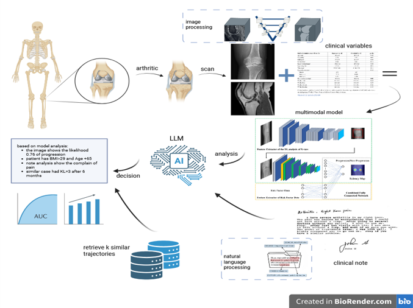

# Doctoral-Showcase-SC25
# 🧠 OAAgent: A Multimodal AI Assistant for Precision Osteoarthritis Care

---

## 🎯 Project Overview

**OAAgent** is an interactive, multimodal deep learning framework designed to predict **knee osteoarthritis progression** by integrating clinical variables and radiological data (X-ray, MRI). This system is designed for **early intervention**, **model explainability**, and **trustworthy decision support** in real-world clinical settings.

This work is a collaboration between **Kent State University** and the **Cleveland Clinic**, presented at the **Doctoral Showcase of SC25**.

---

## 🧪 Methodology

- **Data Sources**: FNIH OAI X-ray, MRI, and Clinical data  
- **Task**: 4-class classification of OA progression (`CASE`: JSL+Pain, JSL-only, Pain-only, Non-progressor)
- **Model**: Late Fusion of ResNet image embeddings with clinical MLP
- **Loss Function**: Focal Loss for class imbalance
- **Interpretability**: SHAP decomposition by modality and patient

---

## 📊 Key Results

| Metric               | Value   |
|----------------------|---------|
| **Test Accuracy**     | 75.36%  |
| **F1 Score (Avg.)**   | 0.75    |
| **Modality Analysis** | Adaptive, patient-specific contributions |
| **SHAP Insights**     | Clinical features dominate predictive power in ~60% patients |

---

## 🔍 Contributions

- 📌 Personalized modality weighting via SHAP  
- 📌 Improved performance on minority class with Focal Loss  
- 📌 Clear alignment between individual modality prediction and fused output  
- 📌 Full interpretability pipeline included

---

## 📁 Repository Structure
To be updated
